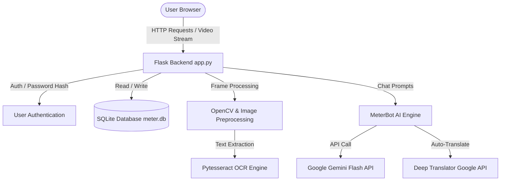

# 📚 Meter Scanner Pro — Technical Architecture & API Reference

This document provides in-depth technical details on the architecture, database schema, OCR engine implementation, and REST API endpoints for **Meter Scanner Pro**.

---

## 🏛️ 1. Architecture Overview

Meter Scanner Pro follows a modern MVC (Model-View-Controller) pattern using Python Flask as the backend application server, SQLite3 for persistent storage, OpenCV/Pytesseract for computer vision processing, and a responsive HTML5/CSS3/JavaScript frontend.



---

## 🗄️ 2. Database Schema (`meter.db`)

The SQLite database consists of 5 primary tables:

### `users` Table
Stores registered user credentials, profile information, and Google OAuth IDs.

| Column | Type | Constraints | Description |
|---|---|---|---|
| `id` | INTEGER | PRIMARY KEY AUTOINCREMENT | Unique user ID |
| `username` | TEXT | UNIQUE, NOT NULL | Account username |
| `password` | TEXT | NOT NULL | Password hash (bcrypt/Werkzeug) |
| `email` | TEXT | UNIQUE | User email address |
| `google_id` | TEXT | UNIQUE | Google OAuth subject ID |
| `first_name` | TEXT | | First name |
| `last_name` | TEXT | | Last name |
| `phone` | TEXT | | Phone number |
| `address` | TEXT | | Billing address |

### `readings` Table
Stores historical meter readings, OCR output, confidence scores, and image references.

| Column | Type | Constraints | Description |
|---|---|---|---|
| `id` | INTEGER | PRIMARY KEY AUTOINCREMENT | Reading ID |
| `user_id` | INTEGER | FOREIGN KEY(users.id) | Linked user account |
| `reading_value` | REAL | NOT NULL | Meter value (kWh, m³, etc.) |
| `confidence` | REAL | | OCR confidence percentage |
| `status` | TEXT | | Status (`detected`, `manual`, `error`) |
| `notes` | TEXT | | Optional notes or meter type |
| `image_path` | TEXT | | Uploaded/captured image file path |
| `timestamp` | DATETIME | DEFAULT CURRENT_TIMESTAMP | Scan timestamp |

### `alerts` Table
Manages custom threshold notifications and reminders.

| Column | Type | Constraints | Description |
|---|---|---|---|
| `id` | INTEGER | PRIMARY KEY AUTOINCREMENT | Alert ID |
| `user_id` | INTEGER | FOREIGN KEY(users.id) | Linked user account |
| `alert_type` | TEXT | NOT NULL | `high_usage`, `bill_threshold`, `reminder` |
| `threshold_value` | REAL | NOT NULL | Trigger threshold value |
| `is_active` | INTEGER | DEFAULT 1 | Active state (1 = active, 0 = disabled) |

### `budgets` Table
Tracks monthly financial spending targets vs actual spend.

| Column | Type | Constraints | Description |
|---|---|---|---|
| `id` | INTEGER | PRIMARY KEY AUTOINCREMENT | Budget ID |
| `user_id` | INTEGER | FOREIGN KEY(users.id) | Linked user account |
| `monthly_budget` | REAL | NOT NULL | Target spending limit (INR) |
| `month` | TEXT | NOT NULL | Target month (`YYYY-MM`) |

### `complaints` Table
Tracks user dispute tickets and maintenance service requests.

| Column | Type | Constraints | Description |
|---|---|---|---|
| `id` | INTEGER | PRIMARY KEY AUTOINCREMENT | Ticket ID |
| `user_id` | INTEGER | FOREIGN KEY(users.id) | Linked user account |
| `subject` | TEXT | NOT NULL | Complaint title |
| `description` | TEXT | NOT NULL | Dispute details |
| `status` | TEXT | DEFAULT 'Open' | Status (`Open`, `In Progress`, `Resolved`) |

---

## 🔍 3. OCR Processing Pipeline (`extract_meter_number`)

When a photo is captured on the `/take_photo` route, the backend executes a multi-stage image processing algorithm:

1. **Frame Selection**: Takes 3 consecutive frames and selects the one with the highest Laplacian variance (sharpest focus).
2. **Color Space Conversion**: Converts RGB to Grayscale.
3. **Denoising & Binarization**: Applies Gaussian Blur followed by Adaptive Thresholding (`cv2.ADAPTIVE_THRESH_GAUSSIAN_C`).
4. **Contour Extraction**: Finds contours using `cv2.findContours()` and filters out non-digit bounding boxes based on aspect ratio (`0.2 <= w/h <= 1.2`) and area thresholds.
5. **Digit Sorting**: Limits candidate contours to top 8 by size, then sorts left-to-right by x-coordinate.
6. **Multi-PSM OCR Execution**: Runs Pytesseract single-character mode (`--psm 10 -c tessedit_char_whitelist=0123456789`) on cropped digit regions.
7. **Fallback Engine**: If contour extraction yields insufficient digits, executes whole-image OCR under PSM modes 6, 7, and 8.

---

## 🔌 4. API Endpoints Reference

### Authentication Routes
- **`POST /login`**: Authenticates user credentials.
- **`GET /google_login`**: Initiates Google OAuth redirect flow.
- **`GET /google/callback`**: Handles OAuth token exchange and session creation.
- **`GET /logout`**: Clears user session.

### Scanning & Meter Operations
- **`GET /video_feed`**: Streams live MJPEG camera feed.
- **`POST /take_photo`**: Captures frame, executes OCR, and records reading to DB.
- **`GET /readings`**: Renders reading history list.
- **`POST /delete_reading/<id>`**: Deletes a specific reading.
- **`GET /export/readings.csv`**: Downloads user scan history as CSV.

### AI Assistant & Chatbot
- **`GET /chatbot`**: Renders embedded MeterBot UI.
- **`POST /chat`**: Accepts `{ "message": "user input" }` JSON, processes input via Gemini / rules engine, handles non-English translation, and returns `{ "response": "markdown response" }`.

### Analytics & Bill Calculation
- **`GET /api/analytics_data`**: Returns 6-month historical consumption JSON for Chart.js.
- **`POST /api/bill_calculator`**: Accepts units consumed and rate, returns itemized bill breakdown.
- **`GET /api/alerts`**: Returns active user alert thresholds.
- **`POST /api/alerts`**: Creates a new user alert threshold.

---

## 🎨 5. Design Tokens & Styling

The frontend utilizes modern CSS variables for glassmorphism, dynamic dark/light themes, and custom color accents:

```css
:root, [data-theme="dark"] {
    --accent: #4f8ef7;
    --accent2: #7c5af7;
    --bg: #0f1724;
    --surface: #182035;
    --border: rgba(79, 142, 247, 0.18);
    --text: #e2e8f8;
    --muted: #8899bb;
}

[data-theme="light"] {
    --bg: #f3f4f6;
    --surface: #ffffff;
    --border: rgba(79, 142, 247, 0.25);
    --text: #1f2937;
    --muted: #4b5563;
}
```

---

## 🧪 6. Testing & Verification

To run system compilation tests and test endpoints programmatically:

```bash
# Verify app compilation
python -m py_compile app.py

# Test /chat API endpoint
python -c "import requests; print(requests.post('http://127.0.0.1:5000/chat', json={'message':'hi'}).json())"
```
